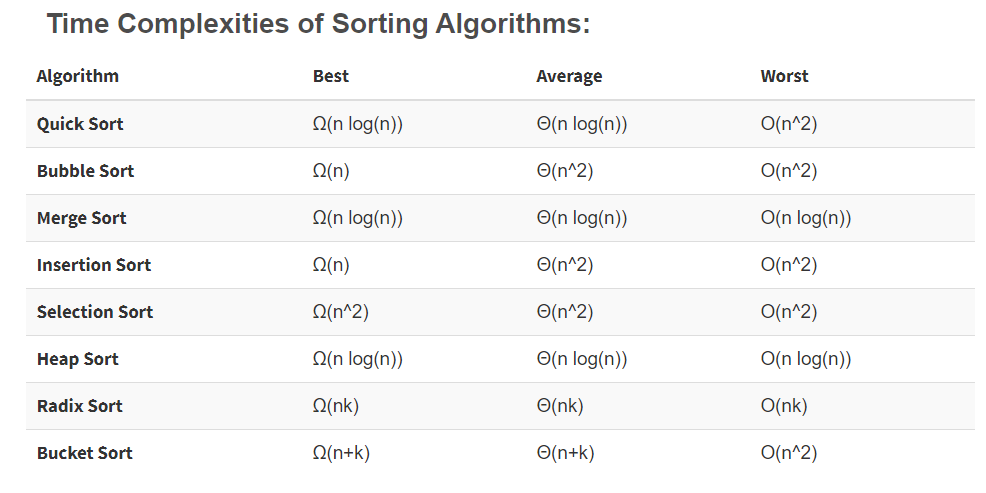

# Cpp tricks inspired from Python
1. [Range fn in Cpp inspired from Python](http://shishtpal.blogspot.com/2015/01/range-function-in-c-inspired-from-python.html#:~:text=range()%20function%20in%20C%2B%2B%20%3A%20Inspired%20from%20Python,-%23%20What%20is%20range&text=%23%20A%20sequence%20of%20numbers%20from,\)%2C%20and%20optional%20step%20parameter.&text=%23%20You%20are%20not%20limited%20to,float%20(%20*%20)%20data%20type.)
# Complexity

## 1. Sorting Algo  
  

# Important Algorithms

## 1. String Matching
  
  #### A) KPM Algorithm
          -> Worst Case : O(N)
          -> [Youtube](https://www.youtube.com/watch?v=V5-7GzOfADQ)
          -> [GFG](https://www.geeksforgeeks.org/kmp-algorithm-for-pattern-searching/)
